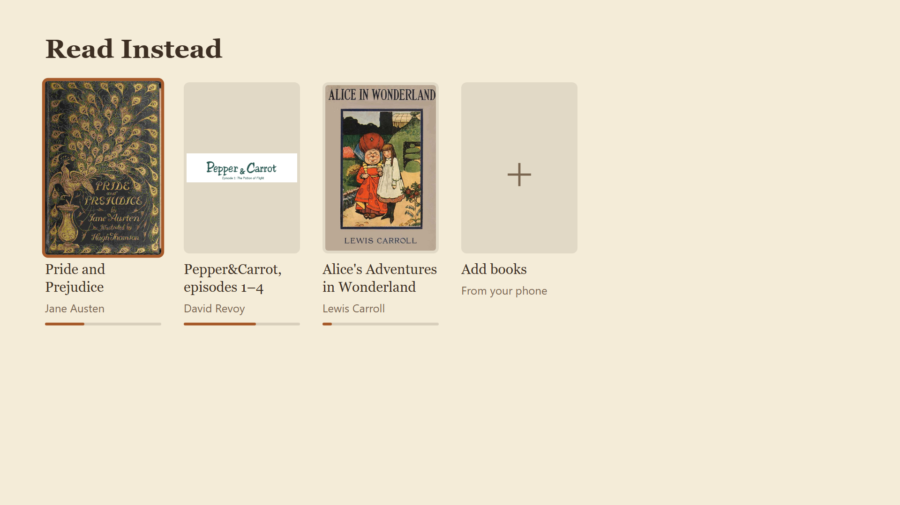
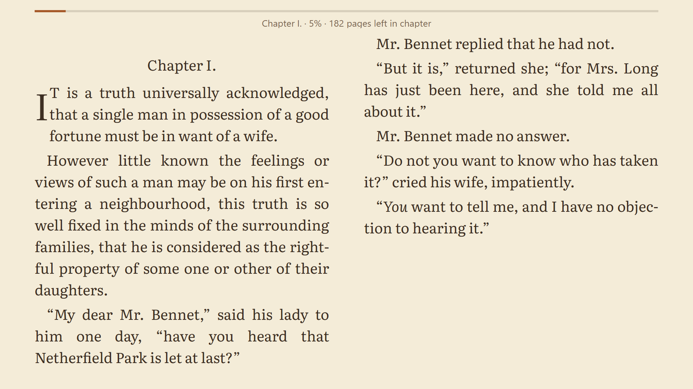
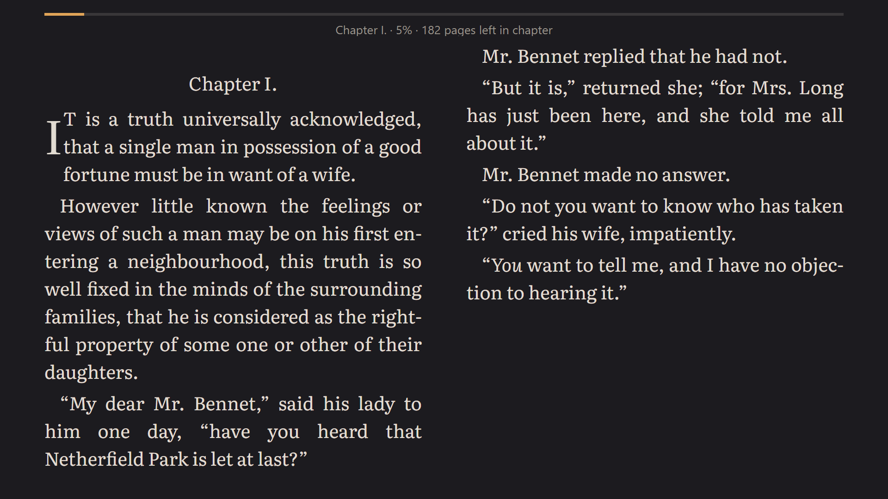
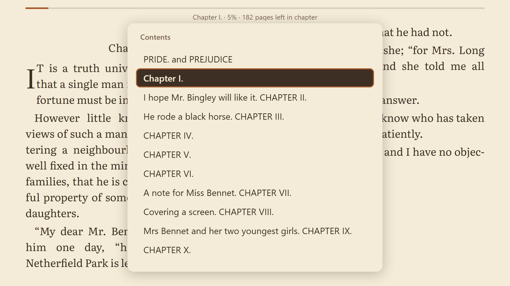
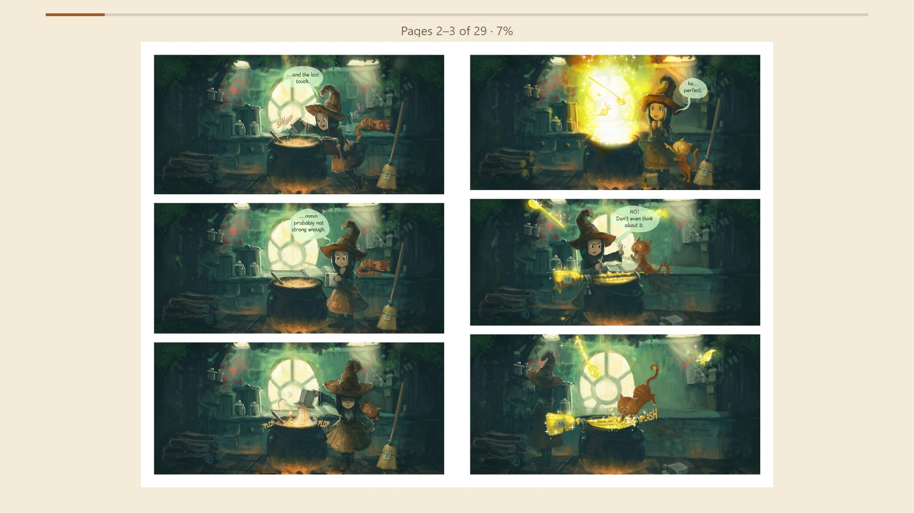
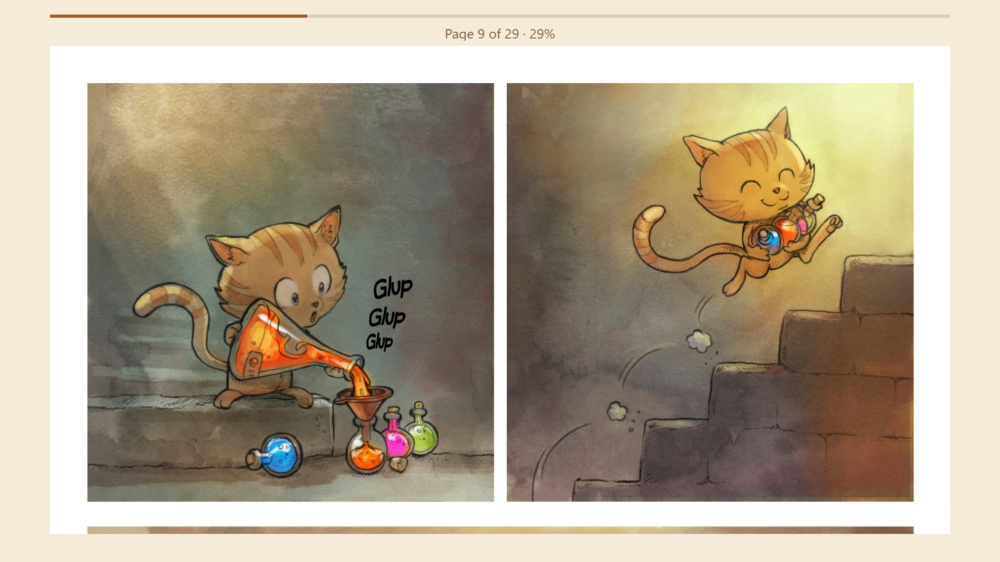
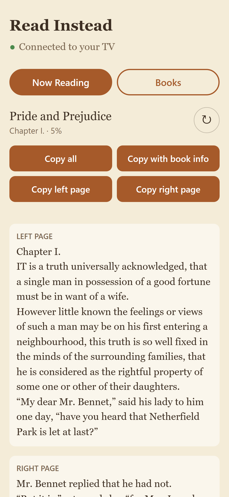

# Read Instead

A two-page e-reader for a Google TV (built for a Sony Bravia 3), so the TV gets used for reading instead of movies. Books are uploaded from a phone over the home Wi-Fi; everything stays local. See the spec in [issue #1](https://github.com/sahithchiluveru/read-instead/issues/1).



| | |
|---|---|
|  |  |
| Two pages at a time; ←/→ on the remote turn them. | Sepia, Dark and Light themes, and two bundled fonts. |
|  |  |
| Contents and Go to % from the Top Bar. | Comics and manga (CBZ), with right to left. |
|  |  |
| Fit-width, for lettering too small to read from the couch. | Now Reading on the phone: copy what's on the TV into ChatGPT or anywhere else. |

Screenshots are the reader at the TV's 1920×1080. Books: *Pride and Prejudice* and *Alice's Adventures in Wonderland* from [Project Gutenberg](https://www.gutenberg.org/) (public domain); comic: [Pepper&Carrot](https://www.peppercarrot.com/) by David Revoy (CC BY 4.0).

## Layout

- `app/`: Android TV shell (Kotlin). A single fullscreen WebView that loads the web reader from the APK's assets.
- `server/`: the Phone API (Kotlin, [Ktor](https://ktor.io/)). The TV app runs it on port 8765 while it's in the foreground, and the phone opens the Phone Page from the QR code on the TV's Add books screen. It also holds the Library: book files, covers and one `library.json` store (book records, Positions, settings such as the Access Key) in the app's private storage. Neither uses Android APIs, so `./gradlew :server:test` runs its tests over real HTTP on any JVM. An open Phone Page notices when the TV app goes away and shows "TV app not reachable"; opening the bookmark while the app is closed shows Chrome's own connection error instead, since a plain-HTTP LAN page can't be cached for offline use.
- `reader/`: the web reader. [foliate-js](https://github.com/johnfactotum/foliate-js) renders EPUBs, [pdf.js](https://mozilla.github.io/pdf.js/) renders PDFs, and CBZ pages are plain images served one at a time by the app. EPUBs are set in the bundled [Literata](https://github.com/googlefonts/literata) or [Atkinson Hyperlegible Next](https://github.com/googlefonts/atkinson-hyperlegible-next) fonts (OFL, from Fontsource). `npm run build` assembles `reader/dist`, and the Gradle build bundles it into the APK as `assets/reader`.
- `reader/fixtures/`: public-domain sample books from Project Gutenberg for trying the app on the TV (upload them from the phone). Moby-Dick was printed to a 530-page A5 PDF.
- `docs/research/`: research notes behind the layout and page-spread decisions.

## Books

Upload books from the Phone Page: EPUB, PDF and CBZ.

- **CBZ** (comics and manga: a ZIP of page images) opens as two-page Spreads, the cover alone, then 2–3, 4–5. Pages go in natural filename order (`page2` before `page10`), and anything that isn't a JPEG, PNG, GIF or WebP image is skipped. The first page is the Shelf cover. Volumes of a few hundred MB are fine: the TV reads one page at a time from the archive, scales down pages much larger than the screen, and keeps only the Spread on screen and the next one in memory.
- **Right to left**: manga's Spreads read right to left, the first page on the right (→ still goes forward). Each CBZ has its own Right to left button in the Top Bar, and a book whose `ComicInfo.xml` says `<Manga>YesAndRightToLeft</Manga>` starts with it on.
- **Fit-width**: when a Spread's lettering is too small to read from the couch, a CBZ's Fit-width button shows one page across the screen; → scrolls down half a screen at a time, then goes on to the next page.
- **CBR** (RAR) isn't supported. Convert it to CBZ first: extract the RAR (e.g. with 7-Zip) and zip its images, then rename the `.zip` to `.cbz`.

## Building

Requirements: JDK 17, Node.js 24, and the Android SDK (`local.properties` with `sdk.dir=...`, or `ANDROID_HOME`).

Windows PowerShell:

```powershell
cd reader; npm ci; npx playwright install chromium-headless-shell; npm test; cd ..
.\gradlew.bat :server:test assembleDebug    # → app\build\outputs\apk\debug\app-debug.apk
```

macOS / Linux / Git Bash:

```sh
cd reader && npm ci && npx playwright install chromium-headless-shell && npm test && cd ..
./gradlew :server:test assembleDebug
```

`npm test` includes the Reader-seam tests, which drive the reader in headless Chromium (the engine behind the TV's WebView) with the remote's keys; the Playwright step downloads that browser once.

Gradle also rebuilds the reader (`npm run build`) on every build, so after the first `npm ci` you only need the Gradle command. If JDK 17 isn't your default Java, set `JAVA_HOME` for the session, for example `$env:JAVA_HOME = "$HOME\tools\jdk-17.0.20.1+1"` in PowerShell.

GitHub Actions runs the same steps on every push. You can download the APK from the run's **read-instead-debug-apk** artifact.

`assembleRelease` works without the release key too, but it builds `app-release-unsigned.apk`, which the TV won't install. Use the debug APK for local testing.

## Releases

Every push to `main` builds a release APK, signs it with the one release key, and publishes it as a [GitHub Release](https://github.com/sahithchiluveru/read-instead/releases) named `v0.1.<run number>`. Its `versionCode` is the workflow run number, so each release is newer than the last and installs over it, keeping your books and Positions. (Don't rename `.github/workflows/build.yml`: the run number would restart at 1, and Android won't install a lower `versionCode` over a higher one.) Until the signing secrets below are set, the workflow skips this and shows a "No release published" notice.

### One-time setup: the release key

Android only installs an update over an existing app if both are signed with the same key. So there is one release key, made once and kept forever.

1. Generate the keystore (`keytool` comes with the JDK, in `$JAVA_HOME/bin`). It asks for one password (a PKCS12 keystore uses the same password for the store and the key); choose a strong one:
   ```sh
   keytool -genkeypair -v -keystore read-instead-release.jks -alias read-instead -keyalg RSA -keysize 4096 -validity 10000 -dname "CN=Read Instead"
   ```
   Don't put it in the repo; `.gitignore` already ignores `*.jks`.
2. Add four repository secrets under **GitHub → Settings → Secrets and variables → Actions → New repository secret**:

   | Secret | Value |
   | --- | --- |
   | `RELEASE_KEYSTORE_BASE64` | The keystore file, base64-encoded (below) |
   | `RELEASE_KEYSTORE_PASSWORD` | The password |
   | `RELEASE_KEY_ALIAS` | `read-instead` |
   | `RELEASE_KEY_PASSWORD` | The same password again |

   To base64-encode the keystore and copy it to the clipboard:
   ```powershell
   # Windows PowerShell
   [Convert]::ToBase64String([IO.File]::ReadAllBytes((Resolve-Path read-instead-release.jks))) | Set-Clipboard
   ```
   ```sh
   base64 -i read-instead-release.jks | pbcopy   # macOS
   base64 -w 0 read-instead-release.jks          # Linux: copy the printed text
   ```
   Or, with the [GitHub CLI](https://cli.github.com/) in the repo folder, skip the clipboard (Git Bash, macOS or Linux):
   ```sh
   base64 read-instead-release.jks | gh secret set RELEASE_KEYSTORE_BASE64
   gh secret set RELEASE_KEYSTORE_PASSWORD   # prompts for the value
   gh secret set RELEASE_KEY_ALIAS --body read-instead
   gh secret set RELEASE_KEY_PASSWORD
   ```
3. **Keep an offline backup** of `read-instead-release.jks` and its password, e.g. on a USB stick and in a password manager. If the key is lost, no new release can install over the old app: you'd have to uninstall it first, and uninstalling deletes every book and Position on the TV.

To sign a release build locally, set the same values as environment variables or Gradle properties (for example in `~/.gradle/gradle.properties`, never in the repo): `READ_INSTEAD_KEYSTORE` (the keystore's path), `READ_INSTEAD_KEYSTORE_PASSWORD`, `READ_INSTEAD_KEY_ALIAS` and `READ_INSTEAD_KEY_PASSWORD`, then run `./gradlew assembleRelease`.

If the app is ever published on Google Play, enroll this same key in [Play App Signing](https://support.google.com/googleplay/android-developer/answer/9842756) (upload your existing key rather than letting Google generate one), so the Play version can update the sideloaded one.

## Installing on the TV (Downloader)

One-time TV setup:

1. Install **Downloader** (by AFTVnews) from the Google Play Store on the TV.
2. **Settings → System → About**, then press OK on **Android TV OS build** 7 times to enable Developer options.
3. **Settings → Apps → Security & restrictions → Install unknown apps** (on some TVs: **Settings → Privacy → Security & restrictions**): turn on **Downloader**.
4. Give the TV a fixed IP address, so the Phone Page bookmark on your phone keeps working: in your router's admin page (usually `http://192.168.0.1` or `http://192.168.1.1`), find the **DHCP reservation** (also called *address reservation* or *static lease*) setting, pick the TV from the list of connected devices (its MAC address is under **Settings → Network & Internet** on the TV), and reserve its current address. The steps differ by router; search for your router model plus "DHCP reservation".

To install or update, open Downloader and enter this URL, which always points at the latest release:

```
https://github.com/sahithchiluveru/read-instead/releases/latest/download/read-instead.apk
```

Downloader downloads the APK; choose **Install**, then **Done**, and delete the APK when Downloader offers to. The app appears in the TV's apps row as the **Read Instead** banner. An update installs over the previous release and keeps your books, Positions and settings. (The repository must be public for Downloader to reach the URL.)

Debug builds (from ADB, below) are signed with a different key, so a release won't install over one: uninstall the debug build first, which deletes its books and Positions.

## Installing test builds on the TV (ADB over Wi-Fi)

One-time TV setup:

1. **Settings → System → About**, then press OK on **Android TV OS build** 7 times to enable Developer options.
2. **Settings → System → Developer options**: turn on **USB debugging** and **Wireless debugging**.
3. In **Wireless debugging**, choose **Pair device with pairing code**. On the PC:
   ```sh
   adb pair <tv-ip>:<pairing-port> <6-digit-code>
   ```

Each time you want to install a build (the same commands work in PowerShell; `adb.exe` lives in `%LOCALAPPDATA%\Android\Sdk\platform-tools`):

```sh
adb connect <tv-ip>:<port shown under Wireless debugging>
adb install -r app/build/outputs/apk/debug/app-debug.apk
adb shell am start -n io.github.sahithchiluveru.readinstead/.MainActivity
```

A debug build can't be installed over a release (they're signed with different keys): uninstall the release first, which deletes its books, or build a signed release locally. The pairing is remembered. The connect port can change after the TV restarts, so check it in the Wireless debugging screen (or run `adb mdns services`). Use the SDK's `platform-tools/adb`: very old adb versions (1.0.32) can't pair.

Reader console output goes to logcat under the `ReadInstead` tag. Page-turn timings are logged as `[turn] ...`:

```sh
adb logcat -s ReadInstead:*
```

## License

[MIT](LICENSE). Bundled libraries and fonts keep their own licenses: foliate-js (MIT), pdf.js (Apache 2.0), Ktor (Apache 2.0), Literata and Atkinson Hyperlegible Next (SIL OFL).
